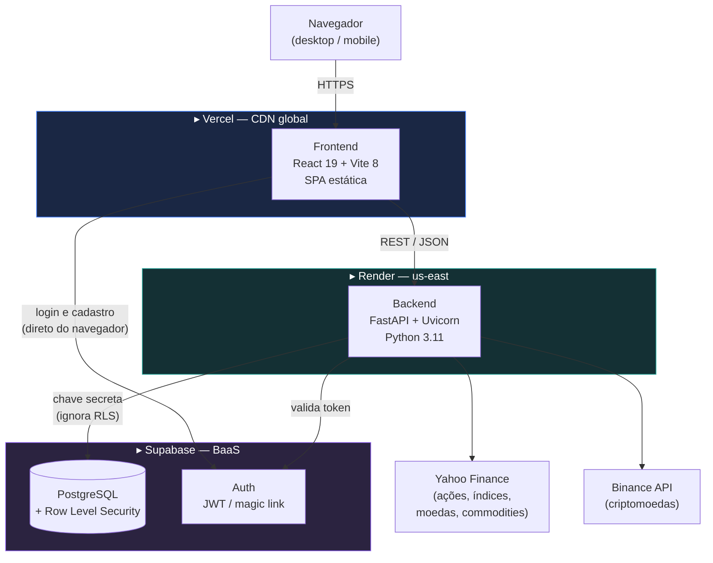
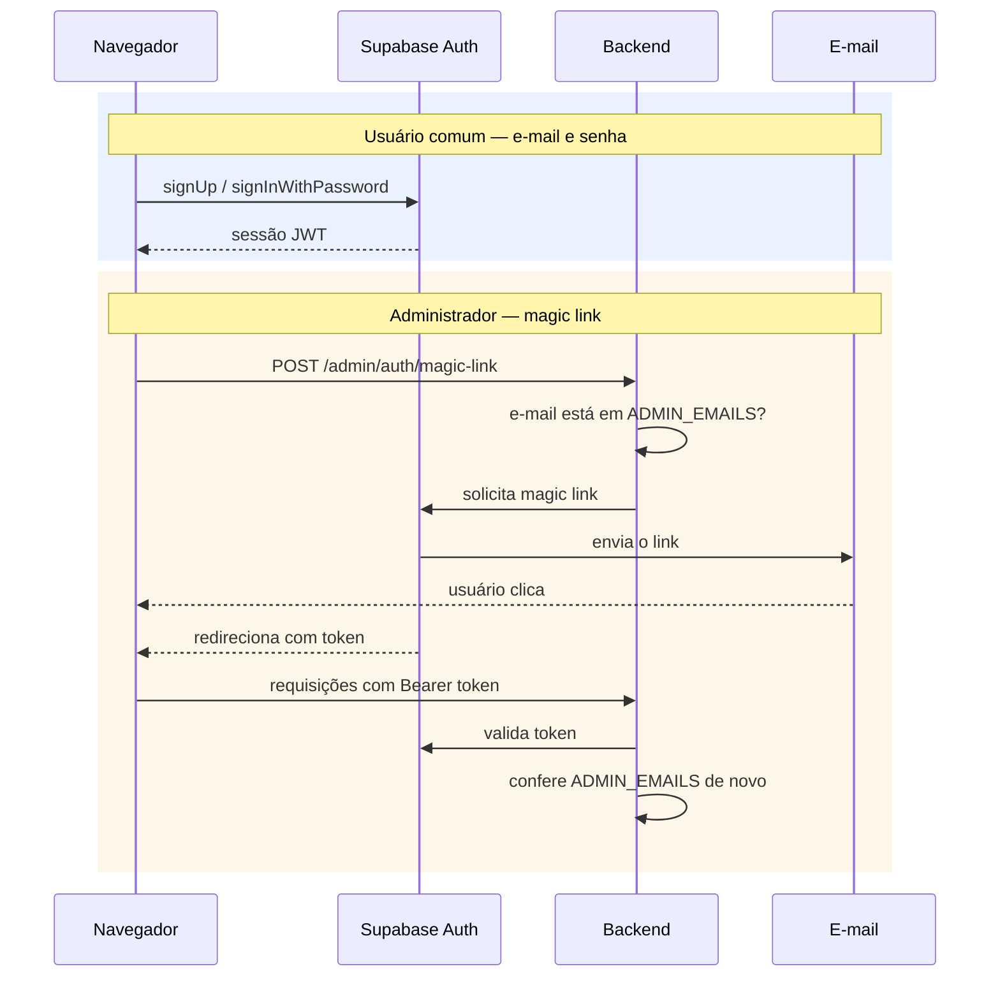
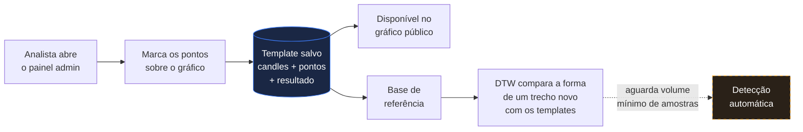
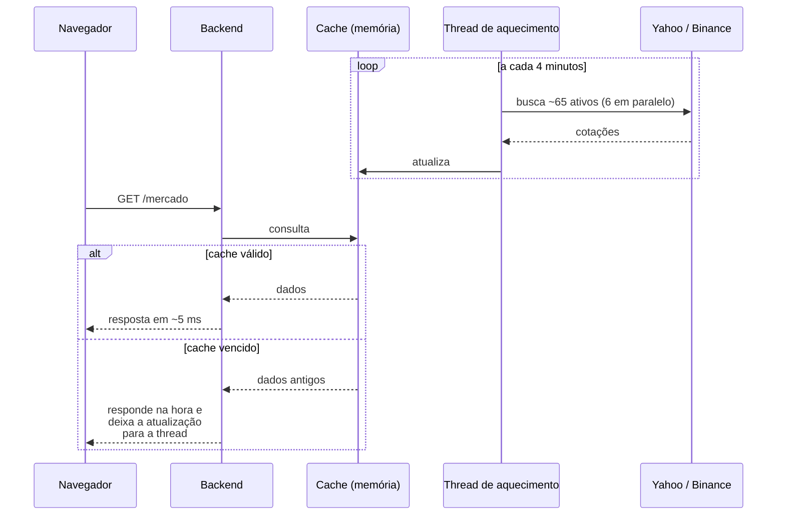

# TradeZen — Documentação de Arquitetura

Plataforma web de análise técnica educacional: exibe gráficos de candles de
ativos da B3, criptomoedas, moedas e commodities, e sobrepõe a eles padrões
gráficos confirmados manualmente por um analista.

**Produção:** https://tradezen.com.br

---

## 1. Visão geral da arquitetura

O sistema é dividido em três serviços hospedados de forma independente, mais
duas fontes externas de dados de mercado.



### Onde cada parte está hospedada

| Camada | Hospedagem | Plano | Observações |
|---|---|---|---|
| **Frontend** | **Vercel** | Hobby (gratuito) | Build estático servido por CDN. Domínio próprio `tradezen.com.br`, com redirecionamento do apex para `www`. Deploy automático a cada push na branch `principal`. |
| **Backend** | **Render** | Free (Web Service) | Python 3.11 fixado via `runtime.txt`. Config declarada em `render.yaml`. Deploy automático pelo GitHub. |
| **Banco + Auth** | **Supabase** | Free | PostgreSQL gerenciado, autenticação e Row Level Security. |
| **Código-fonte** | **GitHub** | — | `anjesiiis/Tradezen`, branch de produção `principal`. |

> **Limitação conhecida do plano Free do Render:** a instância hiberna após
> ~15 minutos sem tráfego e leva ~43s para retomar. Como o cache de cotações
> vive em memória, ele é perdido junto. É o principal gargalo de performance
> em aberto.

---

## 2. Frontend

### Stack

| Tecnologia | Versão | Papel |
|---|---|---|
| React | 19.2 | Biblioteca de interface |
| Vite | 8.0 | Build e servidor de desenvolvimento (bundler: Rolldown) |
| React Router | 7.15 | Roteamento client-side |
| Lightweight Charts | 5.2 | Renderização dos gráficos de candles (canvas) |
| supabase-js | 2.112 | Cliente de autenticação |
| ESLint | 10.2 | Análise estática |

### Técnicas aplicadas

**SPA com roteamento client-side.** Um único bundle atende todas as rotas; a
Vercel reescreve qualquer caminho para `index.html` (`vercel.json`).

**Renderização em canvas sobreposta ao gráfico.** A biblioteca de gráficos
desenha os candles; um `<canvas>` transparente por cima desenha os padrões
gráficos, as ferramentas de desenho e as anotações. Coordenadas de preço e
tempo são convertidas em pixels via a API do próprio gráfico, de modo que os
desenhos acompanham zoom e deslocamento.

**Pointer Events em vez de eventos de mouse.** A captura de cliques para
desenho usa `pointerdown`/`pointerup`, que funcionam de forma idêntica para
mouse e toque — eventos de mouse sintetizados a partir do toque se mostraram
não confiáveis no celular.

**Design responsivo com ponto de corte em 768px.** O layout mobile é
redesenhado por completo (cabeçalho fixo, lista em linhas, barra de navegação
inferior de 5 abas) sem alterar o desktop. Alturas fixas são centralizadas em
variáveis CSS; superfícies usam variáveis que trocam junto com o tema.

**Tema claro/escuro.** Aplicado via atributo `data-theme` no elemento raiz,
com todas as cores derivadas de variáveis CSS.

**Indicadores técnicos calculados no cliente:** SMA (20/100/200), Bandas de
Bollinger, RSI, Estocástico, ATR, VWAP, Volume médio e OBV.

**Ferramentas de desenho:** linha de tendência, linha horizontal, retângulo,
canal, texto, régua de medição e retração de Fibonacci — com histórico de
desfazer/refazer.

---

## 3. Backend

### Stack

| Tecnologia | Versão | Papel |
|---|---|---|
| FastAPI | 0.111 | Framework da API REST |
| Uvicorn | 0.29 | Servidor ASGI |
| Python | 3.11.9 | Runtime (fixado em `runtime.txt`) |
| yfinance | 1.2 | Cliente do Yahoo Finance |
| pandas | 2.2 | Manipulação das séries de preço |
| supabase-py | 2.31 | Cliente do banco e da autenticação |
| SlowAPI | 0.1.10 | Limitação de requisições por IP |
| Pydantic | (via FastAPI) | Validação de entrada e saída |

### Organização dos módulos

```
backend/
├── main.py                    rotas públicas, cache e configuração do app
├── config.py                  variáveis de ambiente
├── supabase_client.py         cliente do banco
├── rate_limit.py              limitador compartilhado
├── admin_auth.py              magic link e verificação de administrador
├── admin_templates*.py        CRUD de cada tipo de padrão (5 módulos)
├── padroes_marcados.py        agrega os padrões para o gráfico público
├── alertas.py                 alertas e notificações do usuário
├── analises.py                estatísticas dos padrões
├── data/fetcher.py            integração com Yahoo Finance e Binance
├── patterns/                  detecção geométrica (pivôs, níveis, clássicos)
├── ml/dtw.py                  comparação de formas (Dynamic Time Warping)
└── sql/                       migrations versionadas do banco
```

### Técnicas aplicadas

**Paralelismo controlado na coleta.** O resumo de mercado busca ~65 ativos com
`ThreadPoolExecutor` limitado a 6 threads. O limite é deliberado: com mais
concorrência o Yahoo Finance passa a derrubar parte das requisições. Há ainda
uma retentativa por ativo, porque falhas isoladas ocorrem mesmo com o ticker
correto.

**Cache em memória com aquecimento em segundo plano.** Montar o resumo custa
~26s. Uma thread daemon o mantém atualizado a cada 4 minutos (TTL de 5), de
modo que a busca pesada nunca acontece durante o atendimento de uma
requisição. Quando o cache está vencido, a resposta devolve o valor antigo
imediatamente e deixa a atualização para a thread — padrão
*stale-while-revalidate*. Um lock impede que duas coletas iguais rodem em
paralelo.

**Camadas de TTL por tipo de dado:** 5 minutos para o resumo de mercado, 30
minutos para candles diários, 1 hora para semanais e mensais.

**Projeção de colunas nas listagens.** As tabelas de padrões guardam o
histórico de preços completo de cada marcação (até ~2.500 candles por linha).
As rotas de listagem selecionam apenas as colunas exibidas; os candles são
carregados sob demanda na rota de detalhe. Sem isso, listar 22 registros
gerava respostas de 13 MB, que derrubavam a instância.

**Limitação de requisições por IP** (SlowAPI), com limites por rota — mais
restritivos no envio de magic link (5/min) e nas rotas que consultam fontes
externas.

**CORS restrito por origem.** Os domínios de produção são fixos no código e
somados ao valor da variável de ambiente, evitando que a configuração dependa
de alguém lembrar de preencher uma variável.

**Cabeçalhos de segurança** em toda resposta: `Content-Security-Policy`,
`X-Frame-Options`, `X-Content-Type-Options`, `Referrer-Policy` e HSTS.

---

## 4. Dados e autenticação

### Modelo de dados (Supabase / PostgreSQL)

| Tabela | Conteúdo |
|---|---|
| `usuarios`, `profiles` | Dados do usuário, criados por trigger no cadastro |
| `templates_oco` | Marcações de Ombro-Cabeça-Ombro (7 pontos) |
| `templates_topo_duplo` | Marcações de Topo Duplo (3 pontos) |
| `templates_niveis` | Suporte e resistência (faixa com N toques) |
| `templates_bandeira_alta` / `_baixa` | Bandeiras (6 pontos: mastro + canal) |
| `rotulagens_oco` | Dados rotulados para treino do modelo |
| `alertas`, `notificacoes_alerta` | Assinatura de alertas e disparos |

**Row Level Security está ativo em todas as tabelas.** As tabelas de conteúdo
administrativo não possuem política alguma — o que, sob RLS, bloqueia todo
acesso via chave publicável. Apenas a chave secreta do backend as enxerga. As
tabelas de usuário têm políticas que restringem cada pessoa à própria linha.

**Notificações por trigger.** Um trigger `AFTER INSERT` nas tabelas de
template verifica quem assinou alertas para aquele ativo e tipo de padrão, e
cria a notificação no próprio banco — sem worker ou cron externo.

### Fluxos de autenticação

São dois fluxos distintos, com credenciais e destinos diferentes.



O painel administrativo é protegido em duas camadas: o e-mail precisa estar na
lista de administradores tanto no momento de pedir o link quanto a cada
requisição subsequente, já que um token válido de usuário comum não deve dar
acesso.

---

## 5. Pipeline de padrões gráficos

A detecção **não** é automática. O sistema é alimentado por marcação manual, e
os dados coletados servem de base para o reconhecimento por similaridade.



**Marcação manual.** Cada tipo de padrão tem sua página no painel, com um
componente de marcação genérico: quem o instancia declara os pontos a capturar
e quais deles ligar com linhas. Ao salvar, o sistema guarda um recorte dos
candles ao redor do padrão, o histórico completo como contexto, os pontos
reindexados e a avaliação do analista.

**Comparação por DTW (Dynamic Time Warping).** Mede a semelhança entre duas
séries de preço independentemente de escala e de pequenas diferenças de
duração. As séries são normalizadas para o intervalo [0,1], eliminando a
escala absoluta — um ativo de R$ 5 e outro de R$ 50.000 passam a ser
comparáveis. A implementação é programação dinâmica em Python puro, sem
dependências externas.

**Estado atual:** 37 templates marcados (22 Topo Duplo, 14
Suporte/Resistência, 1 OCO). A detecção automática está desativada por decisão
de projeto até haver amostras suficientes.

---

## 6. Fluxo de uma cotação



---

## 7. Ferramentas de desenvolvimento

| Ferramenta | Uso |
|---|---|
| **Git / GitHub** | Versionamento; push na branch `principal` dispara os deploys |
| **Vite** | Servidor de desenvolvimento com HMR e build de produção |
| **ESLint** | Análise estática do frontend, com regras de React Hooks |
| **venv** | Isolamento de dependências Python |
| **Migrations SQL versionadas** | `backend/sql/`, numeradas e aplicadas manualmente no Supabase |

### Integração e entrega contínuas

Não há pipeline de CI configurado. A entrega é contínua por integração direta
das plataformas com o GitHub: um push na branch `principal` dispara build e
publicação automáticos na Vercel (frontend) e no Render (backend). Migrations
de banco são aplicadas manualmente no console do Supabase.

---

## 8. Pontos em aberto

| Item | Impacto |
|---|---|
| Instância do Render hiberna (plano Free) | ~43s de espera no primeiro acesso após ociosidade; apaga o cache em memória |
| Ausência de testes automatizados | Toda validação é manual (build, lint e verificação em produção) |
| `App.jsx` concentra ~5.500 linhas | Inclui o CSS da aplicação como template string, o que já causou falhas silenciosas |
| Bundle único de ~860 KB sem divisão | Afeta o primeiro carregamento em redes móveis |
| Detecção automática de padrões desativada | Aguardando volume mínimo de templates |
